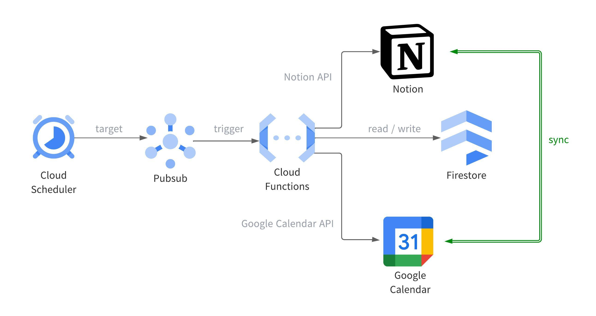
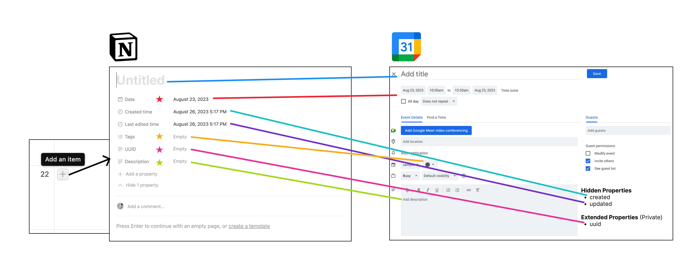
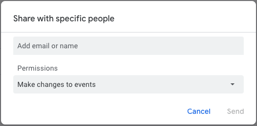

# notion-google-calendar-sync

**notion-google-calendar-sync** is a tool for two-way synchronisation between Notion and Google Calendar.

> [!NOTE]
> The use of this tool is deprecated since the [Notion calendar](https://www.notion.so/product/calendar) was released in January 2024, which can be synchronized with Google Calendar by simply logging in with a Google account.

## Features



* Periodically monitor and synchronize Notion and Google Calendar events
* The tool is deployed to Google Cloud, all using free tier products (Cloud Functions, Cloud FireStore, etc.)
* Terraform code is available

## Prerequisites
* [gcloud CLI](https://cloud.google.com/sdk/docs/install)
* [Terraform](https://developer.hashicorp.com/terraform/downloads)
* [Google Cloud Project](https://cloud.google.com/free)
* [Notion API Integration](https://www.notion.so/help/create-integrations-with-the-notion-api)
* [Google Calendar](https://calendar.google.com/)

The properties to be synchronized between Notion and Google Calendar are shown in the figure below:



Note that the properties marked with an star in Notion must be created by the user before deploying. 
The property name does not have to be `Date`/`Tags`/`UUID`/`Description`, but if it is changed, it should be set to a runtime environment variable (`NOTION_DATE_PROPERTY_NAME`/`NOTION_TAGS_PROPERTY_NAME`/`NOTION_UUID_PROPERTY_NAME`/`NOTION_DESCRIPTION_PROPERTY_NAME`) to distinguish it from other properties when getting events.


## Deploy
Copy the template to `locals.tf` and edit it to match your Google Cloud Project configuration. Be especially careful that `bucket_name` must be globally unique.
```bash
cd terraform
cp locals.tf.tmp locals.tf
```

Enbale the Google Cloud APIs to be used.
You can enable the APIs automatically using Terraform, but it may take some time to be activated, so use the `gcloud` command.
```bash
# terraform/init.sh
PROJECT_ID="xxxxxx-xxxxxxxx-xxxxxx" # Change Required
gcloud auth login
gcloud services enable compute.googleapis.com cloudscheduler.googleapis.com logging.googleapis.com cloudfunctions.googleapis.com eventarc.googleapis.com run.googleapis.com calendar-json.googleapis.com firestore.googleapis.com --project "${PROJECT_ID}"
```

Now we can finally deploy the tool to Google Cloud.

You can change it later on the Google Cloud console, but if it bothers you, you can change the runtime environment variables from [`terraform/main.tf`](https://github.com/Kitsuya0828/notion-google-calendar-sync/terraform/main.tf#L79) before executing the following Terraform commands.

```bash
gcloud auth application-default login
terraform init
terraform plan
terraform apply
```
Once `terraform apply` is complete, you will see your service account email as follows:
```
Outputs:

service_account_email = "notion-google-calendar-sync@xxxxxx-xxxxxxxx-xxxxxx.iam.gserviceaccount.com"
```
Then, in your Google Calendar, remember to grant the appropriate permissions to the service account you have created.



## FAQ
### Can I change the frequency of synchronization?
You can change the frequency of synchronization specified in [`terraform/main.tf`](https://github.com/Kitsuya0828/notion-google-calendar-sync/terraform/main.tf#L29). Please refer to the following URL for the cron job format.

[Cron job format and time zone  \|  Cloud Scheduler Documentation  \|  Google Cloud](https://cloud.google.com/scheduler/docs/configuring/cron-job-schedules)

Note that extremely high synchronization frequency may exceed Google Cloud's free tier.

## License
"notion-google-calendar-sync" is under [MIT License](https://opensource.org/license/mit/).
